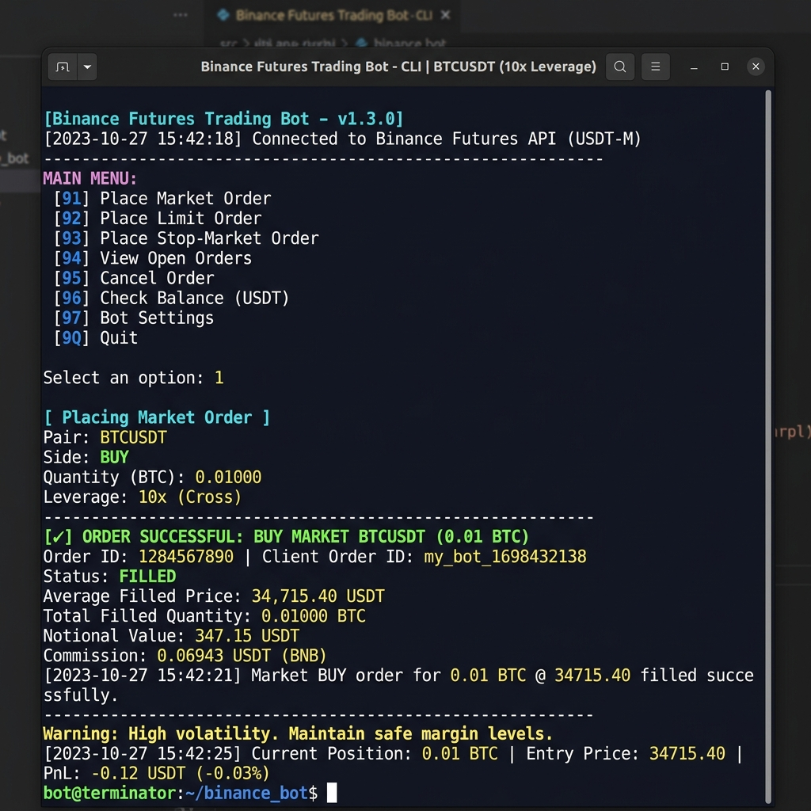
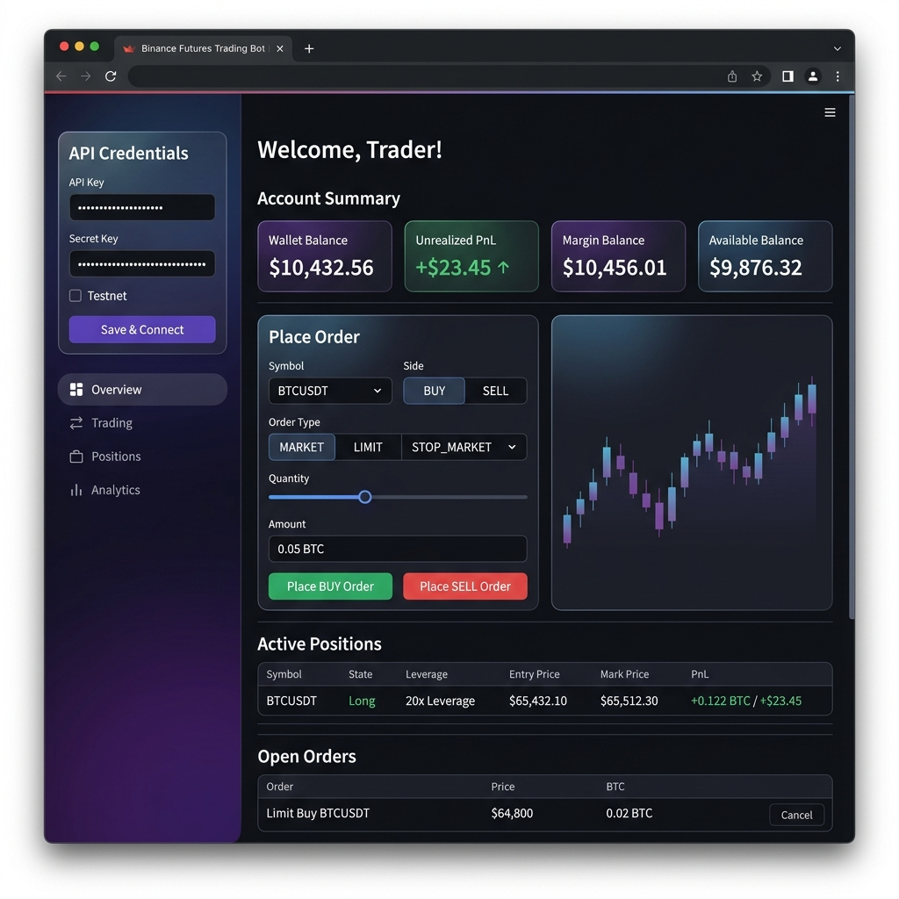

# ⚡ Binance Futures Trading Bot (USDT-M Testnet)

This project is a high-performance Python application designed to place orders (Market, Limit, and Stop-Market) on the **Binance Futures Testnet (USDT-M)**. It features a robust architecture, input validation, structured logging, a rich command-line interface (CLI) with interactive capabilities, and a premium Streamlit dashboard.

---

## Features

- **Order Types Support**:
  - `MARKET` order (BUY/SELL)
  - `LIMIT` order (BUY/SELL) with `timeInForce` support (`GTC`, `IOC`, `FOK`)
  - `STOP_MARKET` order (BUY/SELL) with stop trigger price (Bonus Feature)
- **Double Interface**:
  - **Argparse & Rich CLI**: Place orders directly via parameters, or run a beautiful, colorized interactive terminal menu.
  - **Streamlit Web Dashboard**: Check balances, monitor active positions, view active open orders, place new orders using validation-enabled forms, cancel active open orders, and view live logs.
- **Robust Client Layer**:
  - Direct REST API communication using `requests`.
  - Secure request signing using HMAC-SHA256.
  - Automatically synchronizes system clock with the Binance Futures server time to prevent clock skew/timestamp rejection issues.
- **Comprehensive Error Handling**:
  - Explicit validation of input parameters before API execution.
  - Categorized exception classes (`BinanceAPIError`, `BinanceNetworkError`).
- **Structured File & Console Logging**:
  - Logs all requests, parameters, API responses, and errors to `trading_bot.log` with file names and line numbers.

---

## 📸 Screenshots

### 🖥️ Command-Line Interface (CLI)
The interactive CLI powered by the Rich library provides a beautiful, colorized terminal experience for placing and managing orders.

<p align="center">
  
</p>

### 🌐 Streamlit Web Dashboard
A premium visual dashboard for monitoring balances, placing orders, tracking positions, and viewing live logs — all from your browser.

<p align="center">
  
</p>

---

## Directory Structure

```
trading_bot/ (Workspace Root)
├── bot/
│   ├── __init__.py
│   ├── client.py           # Signed and unsigned API client wrapper
│   ├── orders.py           # Order validation and submission layer
│   ├── validators.py       # Input data validation functions
│   └── logging_config.py   # Configures logger to trading_bot.log & console
├── screenshots/
│   ├── cli_interface.png   # CLI interface screenshot
│   └── dashboard.png       # Streamlit dashboard screenshot
├── app.py                  # Streamlit Web UI dashboard
├── cli.py                  # Command-line interface entry point
├── requirements.txt        # Third-party packages required
├── .env.example            # Environment configuration template
├── .gitignore              # Git ignore rules
└── README.md               # User guide and project documentation
```

---

## Setup & Installation

### 1. Clone or Open the Workspace
Ensure the project files are placed in your working directory.

### 2. Install Dependencies
Initialize a virtual environment (optional but recommended) and run:
```bash
pip install -r requirements.txt
```

### 3. Setup Credentials
Copy the `.env.example` file to `.env`:
```bash
copy .env.example .env
```
Open `.env` and fill in your Binance Futures Testnet credentials:
```env
BINANCE_API_KEY=your_testnet_api_key_here
BINANCE_API_SECRET=your_testnet_api_secret_here
```
> [!NOTE]
> If you do not have credentials, register at [Binance Futures Testnet](https://testnet.binancefuture.com).

---

## How to Run

### Option A: Command Line Interface (CLI)

#### 1. Direct Order Placement
You can submit orders instantly by passing arguments:

*   **MARKET Order**:
    ```bash
    python cli.py --symbol BTCUSDT --side BUY --order-type MARKET --quantity 0.01
    ```
*   **LIMIT Order**:
    ```bash
    python cli.py --symbol BTCUSDT --side SELL --order-type LIMIT --quantity 0.01 --price 68500
    ```
*   **STOP_MARKET Order** (Bonus):
    ```bash
    python cli.py --symbol BTCUSDT --side BUY --order-type STOP_MARKET --quantity 0.01 --stop-price 70000
    ```

#### 2. Interactive Terminal UI
Run the script with no arguments (or pass `--interactive`) to launch a guided command menu:
```bash
python cli.py
```
This lets you place orders, monitor active open orders, cancel orders, and check server sync settings with real-time CLI feedback and prompts.

---

### Option B: Streamlit Web Dashboard (UI)

To start the premium visual web dashboard, run:
```bash
streamlit run app.py
```
This will automatically launch the interface in your browser (usually at `http://localhost:8501`).

- **Credentials Sidebar**: Check, override, or enter API credentials.
- **Account Summary Card**: Live updates of Wallet Balance, Unrealized Profit, Margin Balance, and Available Balance.
- **Place Order Column**: Fully validated dropdowns, sliders, and submit forms.
- **Active Positions**: Shows current open contracts, size, leverage, mark price, and unrealized profit.
- **Open Orders & Cancelation**: List all pending orders with single-click cancellation actions.
- **Log Viewer**: Embeds the last 40 lines of `trading_bot.log` with real-time tailing.

---

## Assumptions & Design Choices

1. **Testnet Precision Rules**: Binance Futures enforces contract-specific minimum quantities (e.g. `0.001` for BTCUSDT) and tick sizes. The bot validates that quantity and price are positive, and the API error handling returns clear responses if precision constraints are violated.
2. **Time Synchronization**: Local clock drift is one of the most common causes of Binance API failures (timestamp errors). The bot queries the server time first to compute an offset adjustment, applying it to all subsequent requests.
3. **Log Formatting**: Standard logging formats are configured for ease of auditing. Console prints are kept minimal and clean (INFO level), while `trading_bot.log` captures deep debug outputs (payloads, full responses) for detailed troubleshooting.
